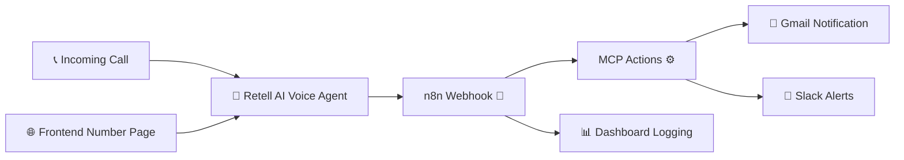

# **IntelliCall Router – AI Voice Agent**

### Built with **Retell AI + n8n + MCP + Slack + Gmail**

<p align="left">
  
  
  
  
  
  
</p>

---

## 🎧 What is IntelliCall Router?

**IntelliCall Router** is a 24×7 inbound **AI voice agent** built using Retell AI.
It answers calls, understands user intent with high accuracy, and routes each call to the right team using a powerful automation stack powered by **n8n** and **MCP actions**.

It also includes:

* A **frontend page** to display your virtual number
* A **full call-log dashboard**
* Context-aware actions (Slack + Gmail)
* Real-time routing to Sales, Support, Billing, and more

---
## Demo 

https://youtu.be/D_hTXDmgT3w?si=705__g_Bzzz_1w5b

## 🚀 Key Features

### 🔹 **AI-Powered Voice Agent (Retell AI)**

* Natural conversation flow
* Intent recognition
* Data extraction
* Multi-step dialogue handling

### 🔹 **Smart Team Routing**

Using n8n + MCP, the agent routes callers to:

* 📞 Sales
* 🛠 Support
* 💳 Billing
* ❓ General Queries
* 🚨 Priority Escalation

### 🔹 **Automation Layer (n8n)**

* Listens to Retell AI webhook events
* Processes call metadata
* Triggers MCP actions
* Sends notifications
* Logs call records to dashboard

### 🔹 **MCP Action System**

* Slack message push
* Gmail auto-email
* Database logging
* Escalation triggers
* CRM integrations

### 🔹 **Frontend Landing Page**

* Displays the virtual number
* Branding + clean UI
* Quick access to dashboard

### 🔹 **Call Dashboard**

* View call logs
* Intent history
* Routing outcomes
* Timestamps
* Caller metadata

---

## 🧩 Architecture Diagram

### **📞 Incoming Call → 🤖 Retell AI → 🔗 n8n → ⚙️ MCP → 🔔 Slack/Gmail → 📊 Dashboard**



---

## 📂 Project Structure

```
/frontend
  ├─ index.html
  ├─ styles.css
  └─ script.js

/dashboard
  ├─ components/
  ├─ pages/
  └─ api/

n8n-workflows/
  └─ retell-inbound.json

retell/
  └─ agent-config.json

mcp/
  └─ actions/
      ├─ routeTeam.js
      ├─ notifySlack.js
      └─ sendMail.js

README.md
.env.example
```

---

## ⚙️ Setup Guide

### **1️⃣ Clone the Repository**

```bash
git clone https://github.com/your-username/intellicall-router.git
cd intellicall-router
```

### **2️⃣ Add Environment Variables**

Create `.env` using the `.env.example` template.

Include:

* RETELL_API_KEY
* N8N_WEBHOOK_URL
* SLACK_WEBHOOK_URL
* GMAIL_USER
* GMAIL_APP_PASSWORD
* SUPABASE_URL
* SUPABASE_KEY

---

## 🧠 Retell AI Setup

1. Create an **Inbound Agent**
2. Add your prompt description + intent rules
3. Add webhook:

```
https://your-n8n-instance/webhook/retell-calls
```

4. Map fields to n8n nodes

---

## 🔗 n8n Workflow Setup

Import:

```
n8n-workflows/retell-inbound.json
```

Workflow includes:

* Webhook trigger
* Intent extraction
* MCP routing
* Slack/Gmail action nodes
* DB logging

---

## ⚡ MCP Action Setup

Example MCP actions:

### **Send Slack Notification**

```js
await slack.send({
  channel: "#alerts",
  text: `New call from ${caller} regarding ${intent}`
});
```

### **Send Gmail Auto-Email**

```js
await gmail.send({
  to: supportEmail,
  subject: `New ${intent} Inquiry`,
  text: details
});
```

### **Route to Team**

```js
route(intent) {
  if (intent === "sales") return "Sales Team";
  if (intent === "support") return "Support Team";
}
```

---

## 📊 Dashboard Overview

The dashboard includes:

* Caller ID
* Intent
* Routing result
* Duration
* Timestamp
* Notes from MCP

Supports Supabase / Firebase / Custom backend.

---

## 📞 Intent Categories (Example)

| Intent           | Routed To       |
| ---------------- | --------------- |
| Sales Enquiry    | Sales Team      |
| Technical Issue  | Support Team    |
| Billing Question | Billing Team    |
| Appointment      | Scheduling Team |
| General Query    | Info Handler    |
| Escalations      | Management      |

---

## 🧪 Testing

* Call simulator in Retell AI
* Trigger webhook manually in n8n
* Validate routing logic
* Check Slack/Gmail messages
* Confirm dashboard entries

---

## 📜 License

MIT License
Feel free to use and extend.

---

## 👤 Author

**Shaid**
GenAI Architect | Voice Agent Builder
🔗 LinkedIn: *https://www.linkedin.com/in/muhibbuddin-shaid-hakkeem-26a06921/*

📧 Email: *ai360_with_shaid@gmail.com*
